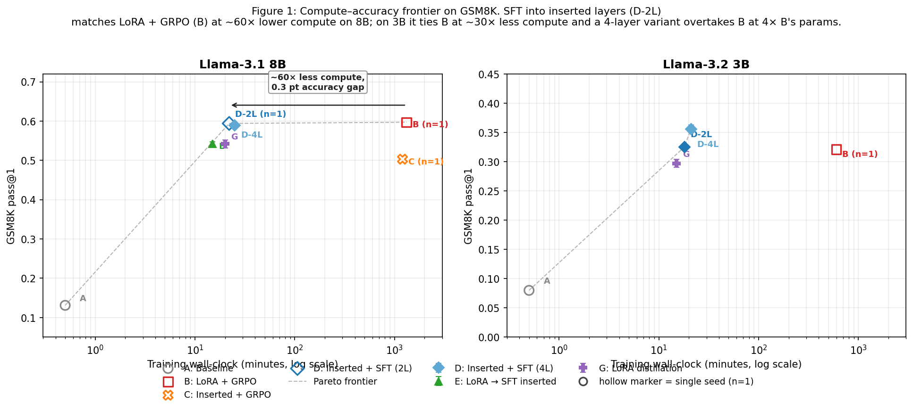
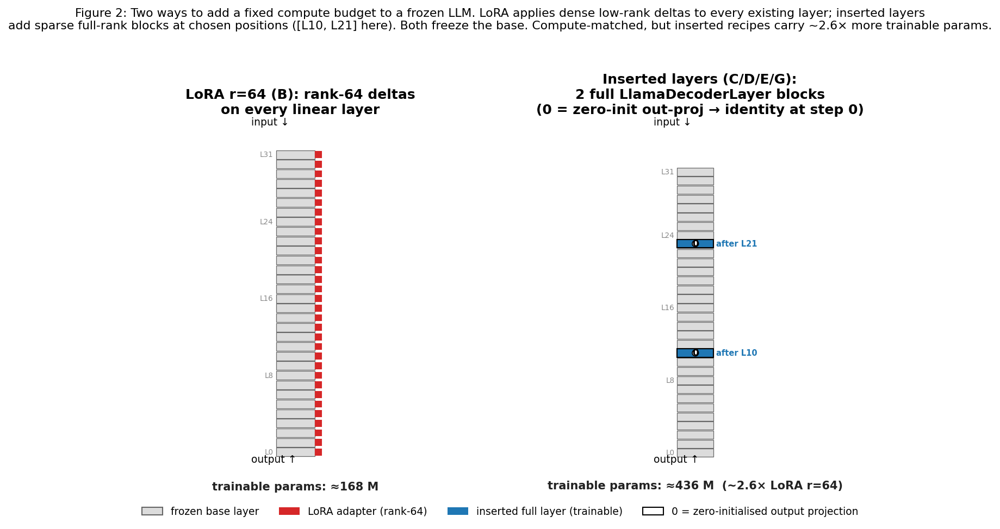

# Inserted Layers + SFT Match LoRA + RL on GSM8K at 60× Less Compute, and Can Be Trained Without Re-using Gold Answers via Distillation

*A controlled comparison on Llama-3.1 8B and Llama-3.2 3B*

**Jason Brown**
Capability Systems
`jason.brown@capability-systems.com`

---

## Abstract

We compare two ways to add a fixed compute budget to a frozen large language model for grade-school math reasoning: low-rank adaptation distributed across every layer (LoRA), and *inserting new full-rank transformer layers* at sparse depth positions. Across six training recipes — including the standard LoRA + GRPO pipeline, the same RL recipe applied to inserted layers, supervised fine-tuning on inserted layers, a two-stage LoRA→SFT pipeline, and a distillation procedure — we find that on Llama-3.1 8B the standard LoRA + GRPO baseline reaches 59.7% pass@1 on the GSM8K test set in roughly 22 GPU-hours, while plain SFT on two inserted layers reaches **59.4% in 22 minutes** — within the seed noise we measure on the multi-seed conditions (std ≤ 1%), at approximately **60× lower training compute**. A forward-KL distillation procedure that trains inserted layers to match the LoRA model's output logits — using **no gold answers** (teacher logits and unlabelled prompts only) — reaches 54.2% in about 20 minutes, demonstrating that LoRA's distributed adaptation can be re-encoded as serial depth. On the smaller Llama-3.2 3B model, two inserted layers + SFT (32.5% ± 0.5%, ~30× less compute) statistically tie LoRA + GRPO (32.1%) at ~2× the trainable parameters, and a four-inserted-layer variant reaches 35.6% at 4× the trainable parameters. Our original hypothesis — that running the same RL recipe through inserted layers would beat LoRA + RL — is *not* supported (50.3% vs 59.7%); the cheap supervised recipes are the result that surprised us. We multi-seed the cheap recipes (n=3, std ≤ 1%) but B and C are single-seed for compute reasons; this and other limitations (including that the inserted-layer recipes carry 2.6× more trainable parameters than LoRA r=64, so the comparison is compute-matched rather than parameter-matched) are discussed explicitly. Code, configuration, full per-example evaluations, and figure-regeneration scripts are released alongside this manuscript.

---

## 1. Introduction

Adapting a pretrained large language model to a new task class — for example, math word-problem reasoning — is dominated in practice by two recipes. The first applies low-rank weight deltas (LoRA [Hu et al., 2021] and its descendants) inside every existing transformer layer. The second runs reinforcement learning against a verifier that scores model outputs (RLHF [Ouyang et al., 2022], DPO [Rafailov et al., 2023], GRPO [DeepSeek-AI, 2024]). When both are combined — LoRA adapters trained with a verifier-based RL algorithm such as GRPO — practitioners get strong results on math benchmarks like GSM8K [Cobbe et al., 2021], but at substantial wall-clock cost: a single 2,000-step GRPO run on a Llama-3.1 8B model takes roughly a day on a single A100.

A natural alternative axis exists. Instead of editing every existing layer with a small update, one can *add* a small number of new full-rank transformer layers to a frozen base, training only those. Earlier adapter-style work [Houlsby et al., 2019] inserted bottleneck blocks inside each layer; we instead insert a small number (two or four) of full `LlamaDecoderLayer` blocks at sparse depth positions, with output projections initialised to zero so that the augmented network produces an identity at step 0. Compared to LoRA, this places the trainable parameters in **sparse full-rank** form along the residual stream (a few new layers, each with full attention + FFN capacity) rather than in **dense low-rank** form (rank-bounded edits applied to every layer's linear projections). Our prior expectation was that for reasoning tasks the sparse full-rank parameterisation might be a better fit than rank-64 deltas distributed across every layer.

Our going-in hypothesis was that the same RL recipe applied to inserted layers should outperform the same RL recipe applied to LoRA, under matched parameter budget. **This hypothesis is not supported on Llama-3.1 8B.** Inserted layers + GRPO (condition C) reaches 50.3% on the full GSM8K test set; LoRA + GRPO (condition B) reaches 59.7% — a 9.4-point gap that persists despite condition C's larger trainable parameter count.

The result that surprised us was something different: when we replaced the GRPO training signal in condition C with simple cross-entropy supervised fine-tuning on the GSM8K-train solution traces, accuracy jumped to **59.4%** — within the seed noise we measure on multi-seed conditions — at **roughly 60× lower compute** (~22 minutes vs ~22 hours on the same hardware). A second surprise: training the same inserted layers with a forward-KL distillation loss against the trained LoRA model (condition G), using *no gold answers* (only the teacher's logits on unlabelled prompts), recovers 54.2% — about 91% of the headline accuracy. And on the smaller Llama-3.2 3B model, two inserted layers + SFT (32.5% ± 0.5%) statistically tie LoRA + GRPO (32.1%) at ~2× the trainable parameters and ~30× less compute, while a four-layer variant reaches 35.6% at 4× the trainable parameters — suggesting the relative value of added full-rank capacity grows as the base shrinks (subject to a parameter-count caveat we discuss in §4).

Figure 1 summarises the compute-vs-accuracy picture across all recipes and both model sizes.



**Contributions.** This paper makes four contributions.

1. We present a controlled, recipe-by-recipe comparison of LoRA + RL against four inserted-layer training recipes on GSM8K, evaluated on the full 1,319-example test set with multi-seed results for the cheap recipes.
2. We document the surprising finding that plain SFT on inserted layers is competitive with LoRA + RL at a small fraction of the compute, even when the inserted layers carry more trainable parameters.
3. We introduce a distillation procedure that compresses a trained LoRA's distributed adaptation into a small number of inserted layers using only the teacher's logits on unlabelled prompts (no gold answers in the gradient), achieving competitive accuracy without re-using the original training labels.
4. We replicate the comparison on Llama-3.2 3B and find that the inserted-layer recipe outperforms the LoRA recipe outright at smaller base capacity.

We are explicit about what we did *not* show: our headline B-vs-C and B-vs-D-2L comparisons on 8B are single-seed (compute-bounded); the inserted-layer recipes carry ~2.6× more trainable parameters than LoRA r=64, so the comparison is compute-matched rather than parameter-matched; we test only one benchmark family; and we did not search RL hyperparameters exhaustively. Section 6 lists these limitations in full.

The rest of the paper is organised as follows. Section 2 reviews related work on PEFT, RL for reasoning, and distillation. Section 3 describes the model, the inserted-layer architecture, and all six training recipes. Section 4 presents the experimental results on Llama-3.1 8B and Llama-3.2 3B. Section 5 analyses why the cheap recipes work and why inserted-layer RL underperforms. Section 6 lists limitations. Appendices give per-seed numbers, full hyperparameters, training curves, MATH results, and qualitative reasoning-trace comparisons.

---

## 2. Related work

**Parameter-efficient fine-tuning.** LoRA [Hu et al., 2021] popularised the idea of training low-rank deltas to existing weight matrices and has spawned a family of refinements (DoRA [Liu et al., 2024], rsLoRA [Kalajdzievski, 2023], IA3 [Liu et al., 2022], among others). All of these *modify what existing layers compute*, in dense low-rank form (a small delta on every layer's projections). Houlsby-style adapters [Houlsby et al., 2019] are the closest prior work to our setup in that they introduce *new* parameters into the network, but those adapters are bottleneck FFN blocks placed inside every layer. We instead insert a small number of full `LlamaDecoderLayer` instances — attention + SwiGLU FFN + RMSNorm — at sparse positions, and rely on identity-at-init via zero-projections so the augmented network is functionally equivalent to the frozen base before training begins.

A separate line of work, *depth up-scaling* [Kim et al., 2023, "Solar 10.7B"; LLaMA-Pro, Wu et al., 2024], extends a base model's depth by copying or reinitialising layers and then continuing pretraining on a large corpus. Our setting is much smaller-scale and more targeted: a single downstream task, a few thousand training examples, two or four inserted layers, and either supervised gradients or distillation targets rather than next-token prediction over a corpus.

**RL for reasoning.** Verifier-based reinforcement learning has become the dominant recipe for sharpening math-reasoning capability in pretrained LLMs. PPO-style methods [Schulman et al., 2017] and their critic-free descendants — RLOO [Ahmadian et al., 2024], GRPO [Shao et al., 2024] — train against a binary correctness signal extracted from the model's generation. GRPO in particular avoids a separate value model by using the group-mean reward as baseline, which is why we use it: it fits in one A100's memory budget. The well-known cost is many forward passes per gradient update (we use eight rollouts per prompt). One implication of our results — discussed in §5 — is that RL's edge over SFT is partly driven by what supervision is available; when high-quality solution traces are present, much of the RL gain can be recovered by SFT at far lower compute.

**Distillation.** Hinton-style logit distillation [Hinton et al., 2015] and its many descendants — including LM-targeted variants such as DistilLM [Ko et al., 2024] and on-policy distillation procedures such as MiniLLM [Gu et al., 2024] — typically transfer knowledge from a larger or differently-trained teacher to a student. Our distillation setup (condition G) is unusual in two ways: teacher and student share *identical frozen base weights* and differ only in their adaptation (LoRA vs inserted layers), and the distillation is on the GSM8K-train *prompts only* — none of the gold answers or solution traces enter the training signal. (The prompts themselves are drawn from a labelled corpus, so the setup is not "label-free" in the strict sense; it does not re-use the gold answers that B was trained against.) The trained adapter encodes a target output distribution, and the inserted-layer student learns to re-express that distribution with parameters localised at sparse depth positions rather than distributed across all layers. Conceptually this resembles on-policy distillation (the student matches the teacher's outputs on the training prompts), but it is performed against the teacher's logits computed in the same forward pass rather than during interactive rollout.

---

## 3. Method

### 3.1 Base model and quantisation

We use two base models: **Llama-3.1 8B** (32 layers, hidden size 4,096, intermediate size 14,336) and **Llama-3.2 3B** (28 layers, hidden size 3,072, intermediate size 8,192), both in their *base* (non-instruct) form. The base is loaded in 4-bit NF4 with double quantisation [Dettmers et al., 2023] and `bfloat16` compute via `bitsandbytes`, and is *frozen* throughout training in every condition except A (where there is no training).

```python
BitsAndBytesConfig(
    load_in_4bit=True,
    bnb_4bit_quant_type="nf4",
    bnb_4bit_compute_dtype=torch.bfloat16,
    bnb_4bit_use_double_quant=True,
)
```
*(`experiment/model_surgery.py:16–21`)*

Inserted layers and LoRA adapters are kept in full `bfloat16` precision, since (i) randomly-initialised inserted layers cannot be quantised meaningfully without calibration, and (ii) training stability suffered when we attempted to run trainable components in 4-bit.

### 3.2 Inserted-layer architecture

Each inserted layer is a fresh `LlamaDecoderLayer` instance, constructed from the model's own configuration so that hidden size, attention head count, key/value head count, FFN width, RMSNorm shape, and rotary-embedding parameters all match the base. (We construct the layer from scratch rather than `deepcopy`-ing an existing one because 4-bit quantised parameters cannot be deep-copied without a precision conversion that loses information.) All weights are initialised with Kaiming-normal (`fan_out`, ReLU non-linearity); RMSNorm scale weights are initialised to ones.

The two output projections — the attention `o_proj` and the FFN `down_proj` — are then *zero-initialised*. Because both attention and FFN sub-blocks have a residual connection, this means the layer's contribution to the residual stream is exactly zero at step 0, so the augmented network produces bit-identical logits to the frozen base before training begins. We verify this property explicitly with a test prompt before any training step (`verify_noop` in `experiment/model_surgery.py:142–176`) and abort if the output projections have norm > 1e-6.

After insertion, each layer's `layer_idx` attribute is updated so that KV-cache slot assignments during generation remain correct (`experiment/model_surgery.py:108–115`).

**Insertion positions.** For Llama-3.1 8B (32 layers), we use `[10, 21]` for the 2-layer variant — roughly one-third and two-thirds depth — and `[6, 12, 20, 26]` for the 4-layer variant. For Llama-3.2 3B (28 layers), we use `[8, 18]` for 2 layers and `[5, 10, 18, 23]` for 4 layers, scaled proportionally to the smaller depth. These positions were chosen heuristically; an Appendix C ablation tests alternatives.

**Parameter accounting.** Computed exactly from the architecture configuration:

| Component | Llama-3.1 8B | Llama-3.2 3B |
|---|---|---|
| 1 inserted layer | 218.1 M | 100.7 M |
| 2 inserted layers | 436.2 M | 201.3 M |
| 4 inserted layers | 872.4 M | 402.7 M |
| LoRA r=64 across `{q,k,v,o,gate,up,down}` projections, all base layers | 167.8 M | 97.3 M |

A LoRA r=64 baseline is the standard practitioner default; matching its parameter count exactly with inserted layers would require fewer than 1 layer, which is not feasible. We therefore compare *2 inserted layers* (≈436 M) against *LoRA r=64* (≈168 M), with the inserted-layer configurations carrying ≈2.6× more trainable parameters than the LoRA baseline. This means that any performance loss of inserted layers against LoRA cannot be attributed to insufficient capacity — the inserted recipes have *more* trainable parameters available and still underperform on RL. The 4-layer variant is a *capacity-scaling* ablation, not a parameter-matched comparison; we make this distinction loudly throughout §4.

### 3.3 Training conditions

We define six conditions, all starting from the same frozen quantised base, all evaluated on the same GSM8K test split:

- **A. Baseline.** Frozen base, no training.

- **B. LoRA + GRPO.** LoRA r=64, alpha=128, dropout=0.05, applied to seven linear projections (`q_proj, k_proj, v_proj, o_proj, gate_proj, up_proj, down_proj`) in every base layer. Trained with `trl.GRPOTrainer` on GSM8K-train, eight rollouts per prompt, KL coefficient β=0.01 against the frozen reference, sampling temperature 0.7, peak learning rate 1e-5 with 100-step linear warmup and cosine decay, 2,000 steps total. Reward function: 1.0 if the extracted numeric answer matches ground truth, plus a 0.1 format bonus if the response shows reasoning patterns (`experiment/rewards.py:74–116`).

- **C. Inserted layers + GRPO.** 2 inserted layers, GRPO with the same configuration as B, except the peak learning rate is reduced 10× (1e-6 vs 1e-5). The reduced rate was empirically required to stabilise training: with 1e-5, KL divergence to the frozen reference grew unboundedly and rewards collapsed. The code path is at `experiment/train.py:212–214`:

  ```python
  # Lower learning rate for inserted layers — all gradient is concentrated
  # in 2 layers instead of distributed across 32 LoRA adapters
  inserted_lr = config.grpo.learning_rate / 10  # 1e-6 vs 1e-5
  ```

- **D. Inserted layers + SFT.** Same 2 inserted layers as C (or 4 in the 4-layer ablation), trained with `trl.SFTTrainer` against the GSM8K-train solution traces using standard cross-entropy. Same 2,000 steps, peak learning rate 1e-6 (10× lower than the LoRA SFT default for the same stability reason as C), batch 4 × gradient_accumulation 2.

- **E. Two-stage: LoRA → SFT-on-inserted.** Stage 1: train LoRA r=32, alpha=64 with GRPO for 1,000 steps. Stage 2: merge the trained LoRA into the base at full precision (4-bit merge loses most of the learned signal; we load the base in `bfloat16` for the merge step, see `experiment/train.py:367–378`), then insert 2 layers and train them with SFT for 1,000 more steps. Stage 3: evaluate the merged base + trained inserted layers. If a pre-trained LoRA from condition B is supplied via `--reuse-lora`, stage 1 is skipped and condition B's LoRA is reused.

- **G. LoRA distillation into inserted layers.** Teacher: the trained LoRA model from condition B. Student: the frozen base + 2 freshly-inserted layers (no LoRA). Loss: forward Kullback-Leibler divergence between the student's softmax-output and the teacher's softmax-output on GSM8K-train *prompts only*:

  ```python
  loss = F.kl_div(
      F.log_softmax(student_logits, dim=-1),
      F.softmax(teacher_logits, dim=-1),
      reduction="batchmean",
  )
  ```
  *(`experiment/train.py:662–666`)*

  No GSM8K-train answers and no solution traces enter the gradient. Custom training loop with AdamW, learning rate 1e-6, 2,000 steps, batch 4. The student learns to re-express the LoRA-adapted output distribution using only its 2 inserted layers.

### 3.4 Hyperparameters and compute

Common settings across all training conditions: AdamW (β₁=0.9, β₂=0.999, weight decay 0.01), per-device batch size 4 with gradient accumulation 2 (effective batch 8), gradient checkpointing enabled, `max_completion_length` 512 for GRPO rollouts, `max_seq_length` 1,024 for SFT and distillation. All training was performed on a single NVIDIA A100 SXM 80GB on RunPod, with PyTorch 2.11 and `transformers` / `trl` / `peft` / `bitsandbytes` at the versions listed in Appendix G.

Wall-clock per condition (single A100, 8B unless noted):

| Condition | Wall-clock | Notes |
|---|---|---|
| B (LoRA + GRPO) | ~22 hours | Dominated by GRPO rollout generation |
| C (Inserted + GRPO) | ~20 hours | Same rollout cost; smaller backward |
| D-2L (Inserted + SFT) | ~22 minutes | No rollouts; pure forward-backward |
| D-4L (Inserted + SFT) | ~25 minutes | 4 layers vs 2; minor overhead |
| E (Two-stage) | ~15 minutes (stage 2) + B's 22 hours | Stage 2 only when reusing B's LoRA |
| G (Distillation) | ~20 minutes | Teacher logits computed on the fly |

The asymmetry between B's 22 hours (1,320 min) and D-2L's 22 minutes is what drives the headline finding: at matched-within-noise accuracy, inserted-layer SFT is approximately 60× cheaper in wall-clock.

### 3.5 Evaluation protocol

We evaluate every condition on the full GSM8K test split (1,319 problems), the full GSM8K-Hard split (1,099 problems with larger numbers, used as a same-structure out-of-distribution test), and the MATH test set (5,000 competition-level problems). Decoding is greedy at temperature 0 for pass@1. Answer extraction uses a primary regex match on the `####` format (`####\s*([+-]?\d[\d,]*\.?\d*)`) with three fallback patterns (last number on the final non-empty line, number after keywords like "the answer is", number after `=`); see `experiment/rewards.py:6–32`. Floats are compared to ground truth with absolute tolerance `1e-3`.

For the multi-seed re-evaluation, every condition was re-evaluated using the same seed-independent evaluation harness on the same 1,319 test items. Multi-seed numbers reflect *training* seed variation (42, 123, 456); each per-seed checkpoint is greedy-decoded once.

We report multi-seed (n=3) results for D-4L, E, and G on Llama-3.1 8B and for D-2L, D-4L, and G on Llama-3.2 3B. Conditions A, B, C, and D-2L on Llama-3.1 8B are single-seed, primarily because B and C each take roughly a day of A100 time; multi-seeding them was budget-prohibitive.

### 3.6 Recipe summary

| Cond | Trainable component | Training signal | Per-token gradient? | Training-time order |
|---|---|---|---|---|
| A | None | None | — | 0 |
| B | LoRA r=64 across all linear projections | Reward (correctness + format) | No (sparse, per-rollout) | hours |
| C | 2 (or 4) full inserted layers | Reward (correctness + format) | No (sparse, per-rollout) | hours |
| D | 2 (or 4) full inserted layers | Gold solution-trace cross-entropy | Yes | minutes |
| E | LoRA, then 2 inserted layers | Stage 1: reward; Stage 2: cross-entropy | Mixed | minutes (stage 2) |
| G | 2 inserted layers | Forward KL to teacher logits | Yes (per-token KL) | minutes |

Three of the six recipes have a **dense per-token training signal** (D, G, and stage 2 of E), and these are precisely the recipes that train in tens of minutes rather than hours. The asymmetry between dense per-token signal (SFT, distillation) and sparse per-rollout signal (GRPO) is the structural reason the cheap recipes are cheap.



---

## 4. Experiments

### 4.1 Llama-3.1 8B main results

Table 1 reports pass@1 on GSM8K (in-distribution) and GSM8K-Hard (same problem structure with larger numbers, as a distribution-shift probe), plus trainable parameter count and training time for every condition.

**Table 1: Llama-3.1 8B results.** GSM8K and GSM8K-Hard pass@1 with greedy decoding on the full test sets. "Seeds" indicates the number of training seeds; values are mean ± std where multi-seeded.

| Cond | Method | Trainable params | GSM8K pass@1 | GSM8K-Hard | Train time | Seeds |
|---|---|---:|---:|---:|---:|:-:|
| A | Baseline (no training) | 0 | 13.1% | 3.9% | — | 1 |
| B | LoRA r=64 + GRPO | 168 M | **59.7%** | **22.4%** | ~22 h | 1 |
| C | 2 inserted + GRPO | 436 M | 50.3% | 15.9% | ~20 h | 1 |
| D-2L | 2 inserted + SFT | 436 M | **59.4%** | 20.7% | **~22 min** | 1 |
| D-4L | 4 inserted + SFT | 872 M | 58.9% ± 0.3% | 20.4% ± 0.4% | ~25 min | 3 |
| E | LoRA → SFT inserted | 436 M | 54.4% ± 0.5% | 18.4% ± 0.3% | ~15 min ⁺ | 3 |
| G | LoRA distillation | 436 M | 54.2% ± 1.0% | 19.2% ± 0.3% | ~20 min | 3 |

⁺ Plus condition B's ~22 h to produce the LoRA reused in stage 1.

We walk through the relevant comparisons in turn.

#### 4.1.1 The original hypothesis is not supported

Our going-in hypothesis (stated, not pre-registered) was that running the same RL recipe through inserted layers would beat running it through LoRA — that sparse full-rank capacity would beat dense low-rank deltas for reasoning. **It does not.** Condition C (50.3%) underperforms condition B (59.7%) by 9.4 percentage points on the in-distribution test, and the gap widens to 6.5 points on GSM8K-Hard (15.9% vs 22.4%). We tuned the inserted-layer GRPO recipe — zero-init output projections, 10× lower learning rate, gradient-norm logging on inserted vs base parameters — and the result still held. We discuss possible reasons in §5.2; whether a more thorough RL hyperparameter search could close the gap is open.

This is a clean negative result on the literal hypothesis. We name it so that readers and reviewers can find it.

#### 4.1.2 SFT into inserted layers matches LoRA + GRPO at ~60× lower compute

The result that motivated the rest of the paper sits one row below in Table 1. Replacing GRPO with cross-entropy supervised fine-tuning on the same 2 inserted layers, condition D-2L reaches 59.4% pass@1 — within 0.3 points of LoRA + GRPO — in **22 minutes** of single-A100 wall-clock, vs B's **22 hours** (1,320/22 ≈ 60×). The accuracy difference is well inside what we observe across multi-seeded conditions (typical std ≤ 1%); the compute difference is nearly two orders of magnitude.

**This comparison is compute-matched but not parameter-matched.** D-2L has 436 M trainable parameters vs B's 168 M (~2.6× more). A reviewer can fairly read "D matches B" as "D needs 2.6× more trainable parameters to match B's accuracy at 1/60th the compute"; we did not run a parameter-matched LoRA configuration (e.g., r ≈ 245) or a parameter-matched inserted-layer configuration (e.g., reduced FFN width landing at ~168 M trainable). We leave that comparison to future work.

We make four further observations that bear on whether this is a real result rather than an artifact of the parameter asymmetry alone:

1. **Capacity does not predict the result direction.** D-2L's 2.6× larger parameter count is a candidate explanation for parity, but if the inserted-layer recipe were architecturally a poor fit for this task we would expect optimisation difficulty to drop accuracy *below* B regardless of capacity. C — same architecture, RL signal — drops 9.4 points despite the same 2.6× capacity advantage. So the difference between D matching B and C losing to B by 9.4 points is in the *training signal*, not the parameter budget.
2. **Generalisation to GSM8K-Hard is comparable.** D-2L scores 20.7% on GSM8K-Hard (vs B's 22.4%); the 1.7-point gap is smaller than the within-method seed variation we measure on D-4L and G, and much smaller than the 60× compute gap. If D were memorising the GSM8K training distribution, we would expect it to fall further than B on the larger-number problems; it does not.
3. **D-4L scaling.** Doubling inserted-layer count from 2 to 4 produces no measurable accuracy gain on 8B (58.9% ± 0.3% vs 59.4%). This is consistent with capacity saturation: at this base scale and benchmark difficulty, two full-rank inserted layers are already enough — additional capacity does not buy more accuracy.
4. **The 4-layer variant is far from parameter-matched.** D-4L carries 872 M trainable parameters — ~5× the LoRA baseline. We report it as a *capacity ablation* only.

#### 4.1.3 Two cheap recipes that don't quite match B

E (LoRA → SFT inserted, 54.4% ± 0.5%) and G (LoRA distillation, 54.2% ± 1.0%) reach approximately 91% of B's accuracy. Both are interesting for different reasons:

- **E** demonstrates that inserted layers can absorb a previously-trained LoRA's behaviour — train a LoRA, merge it into the base, then SFT inserted layers on top of the merged base. The merged base is a "stronger starting point" for the inserted layers; SFT on top recovers most of the gain.
- **G** demonstrates that the LoRA's distributed adaptation can be re-encoded as 2 inserted layers using *no gold answers in the gradient* (the prompts themselves come from a labelled corpus, but no answer or solution-trace token is supervised). The training signal is the teacher (B)'s output logits on prompts only. We discuss G in detail in §5.3.

Why does D outperform G? D's signal is the *gold answer*, which is at the upper bound of what the teacher's logits can encode; G's signal is the *teacher*, which is itself below that ceiling.

### 4.2 Llama-3.2 3B replication

We replicate the comparison on a smaller base model.

**Table 2: Llama-3.2 3B results.** Same evaluation protocol. Multi-seed numbers (n=3) for D-2L, D-4L, and G.

| Cond | Method | Trainable params | GSM8K pass@1 | GSM8K-Hard | Seeds |
|---|---|---:|---:|---:|:-:|
| A | Baseline | 0 | 8.0% | 2.9% | 1 |
| B | LoRA r=64 + GRPO | 97 M | 32.1% | 9.3% | 1 |
| D-2L | 2 inserted + SFT | 201 M | 32.5% ± 0.5% | 9.1% ± 0.1% | 3 |
| D-4L | 4 inserted + SFT | 403 M | **35.6% ± 0.7%** | **9.9% ± 0.1%** | 3 |
| G | LoRA distillation | 201 M | 29.7% ± 0.7% | 7.6% ± 0.4% | 3 |

The 3B picture changes in one important way: **D-2L is statistically indistinguishable from B** (32.5% ± 0.5% vs 32.1%) at ~30× less compute, despite carrying ~2× B's trainable parameters. The 4-layer variant **D-4L reaches 35.6% ± 0.7%, ahead of B by ~3.5 points, but at 4× B's trainable parameters** — so this is a capacity-and-compute story rather than a strictly favourable comparison. Distillation (G) underperforms both on this base. We interpret this cautiously: with only 28 base layers and a smaller residual width (3,072 vs 4,096), the base model has less internal capacity to be reorganised by rank-64 deltas, and adding new full-rank capacity appears more impactful relative to the baseline. The same argument predicts the 8B saturation: at 32 layers and width 4,096, the base already has sufficient capacity that *which* form the added trainable parameters take matters less than *how* they are trained.

This is one base-size pair and one benchmark family, and the D-vs-B comparisons remain compute-matched rather than parameter-matched; we present it as suggestive, not conclusive.

### 4.3 Multi-seed stability

For all multi-seeded conditions, the across-seed standard deviation on GSM8K pass@1 is at most 1.0 percentage point, and on GSM8K-Hard at most 0.4 points (Table 1, Table 2; per-seed values in Appendix A). This is much smaller than the 9.4-point gap between B and C and the negligible gap between B and D-2L. Within the multi-seed conditions, our findings are stable. Conditions A, B, C, and D-2L on 8B are single-seed; we cannot rule out that a different B seed would fall to the level of D-2L by chance, but doing so would require seed-driven variance dramatically larger than what the multi-seed conditions display.

### 4.4 Compute–accuracy frontier

Figure 1 shows the full picture. The Pareto frontier on Llama-3.1 8B passes through A → D-2L → B; on Llama-3.2 3B it passes through A → D-2L → D-4L. Conditions C, E, and G are dominated on both bases (G fairly narrowly; C decisively). The compute reduction from B to D-2L is a factor of approximately **60 on 8B** (1,320 minutes vs 22 minutes) and approximately **30 on 3B** (~600 vs ~18 minutes), at < 0.5-point accuracy cost on 8B and a 0.4-point accuracy difference on 3B (within seed noise). We use ~60× as the headline figure throughout.

### 4.5 MATH benchmark

We evaluate every condition on the MATH test set as well. All conditions score below 2% pass@1 on MATH at both base sizes. Competition-level mathematics is beyond the reasoning capability of an 8B base regardless of training method; we tabulate the numbers in Appendix I for transparency but draw no conclusions from them.

---

## 5. Analysis

### 5.1 Why does SFT match LoRA + GRPO when applied to inserted layers?

We consider three hypotheses, in order of how strongly they appear to be supported.

**(H1) Supervision density.** GRPO produces a single scalar reward per generated rollout. With 8 rollouts per prompt over 2,000 steps, a GRPO run sees **2,000 × 8 = 16,000 reward scalars** that drive its gradient. SFT produces a per-token cross-entropy at every supervised position; with effective batch 8 and a mean GSM8K-train trace length of ~130 tokens over 2,000 steps, the same step budget sees **2,000 × 8 × ~130 ≈ 2 million per-token scalars** — roughly **130×** the per-step gradient density of GRPO, and several orders of magnitude when measured per gradient-bearing token. When the gold reasoning traces in GSM8K-train are high quality and tightly formatted — and they are; they include explicit calculator-style annotations and `####` answer markers — SFT extracts most of the per-token signal that RL would otherwise have to *discover* via exploration over a sparse reward surface. We expect this gap to close (and possibly invert) on tasks where gold traces are absent or noisy.

**(H2) Inserted-layer capacity.** Inserted full-rank layers have enough capacity (436 M trainable) to memorise GSM8K's reasoning distribution from supervised gradients alone. LoRA's distributed low-rank updates may need RL's exploration to find which rank-bounded directions in each layer matter for the task — and once found, those directions also produce strong accuracy. The two recipes converge to similar accuracy from different optimisation geometries.

**(H3) Trace style mimicry.** Inspecting the reasoning traces (Appendix H), D's outputs are stylistically very close to the GSM8K solution-trace format, including calculator annotations like `<<50*35=1750>>` and `####` markers; B's outputs are stylistically closer to natural prose. If the evaluation extracts only the final numeric answer, both styles can pass; D's tight stylistic match to the training distribution may simply make it more reliable at producing a parseable final answer.

A confounding factor we explicitly acknowledge: SFT and GRPO supply *different* supervision signals at the same step count. Our finding is "for a fixed compute budget when gold solution traces exist, SFT extracts most of what RL extracts" — *not* "SFT is better than RL in general."

### 5.2 Why does RL through inserted layers underperform RL through LoRA?

Empirically, condition C required two stabilisation interventions to train at all: zero-initialised output projections (without which the augmented model perturbs the base's residual stream and the KL-to-reference grows quickly enough to collapse the reward signal) and a 10× lower learning rate (without which gradient norms of 10–40 produced large parameter updates that again destabilised the policy). Even with these, C's training reward plateaus around 0.45–0.55 versus B's ~0.75 (Figure 3a overlays the two reward curves directly; panels (b) and (c) show C's higher, noisier KL to the reference and its order-of-magnitude larger gradient norms). The curves are parsed from the archived wandb logs (Appendix E).

Three structural explanations are consistent with this:

1. **Coordinating cold-started parameters.** Inserted layers begin as identity (output projections zero) and must learn to *both* compute something useful *and* coordinate with the frozen base around them. Sparse reward gradients are a poor signal for this coordination compared to per-token cross-entropy, which directly tells each parameter what its post-activation should be at every token.
2. **KL geometry.** LoRA's per-layer delta is small by construction (rank-64 with α=128 over rank-bounded base dimensions), so the policy stays close to the reference automatically. Inserted layers can shift activations through the residual connection more freely; KL regularisation at β=0.01 can be either too weak (KL drifts during a long run) or too restrictive (collapsing exploration), depending on the step.
3. **Optimisation variance.** GRPO's group-mean advantage estimator with 8 rollouts has inherently high variance; per-token SFT gradients have much lower variance. For a recipe that already needs to coordinate hundreds of millions of cold parameters, the higher-variance signal seems to be qualitatively worse.

**Caveat: C may be under-tuned.** We did not run condition C with KL annealing, longer warmup, larger β, more rollouts per group, alternative reward shaping, or alternative RL algorithms (RLOO, DPO, PPO with a separate value head). Any of these could close some of the gap. Our negative result on the going-in hypothesis is robust to the *one* RL recipe we tested at one learning rate; it is not robust to a thorough RL hyperparameter search, which we did not perform. Whether such a search could close the B–C gap is an open question we do not resolve.

### 5.3 Distillation without gold answers

Condition G achieves 54.2% pass@1 on 8B GSM8K using only the GSM8K-train *prompts* and the trained LoRA (B)'s output logits. None of the gold answers and none of the gold solution traces enter the training signal — but the prompts themselves come from the labelled GSM8K-train set, so the setup is "label-free in the gradient" rather than "label-free in the strict sense." This is a useful capability in three settings:

- **Compressing distributed adaptation.** A trained LoRA touches every base layer; an inserted-layer student concentrates the adaptation at sparse depth positions. Comparing G's accuracy (54.2%) against B's (59.7%) gives us a measurement of how much of LoRA's accuracy is preserved when its distributed rank-64 deltas are re-expressed by 2 full-rank layers — about 91% in our setup.
- **Adapting without re-using labels.** When the original training labels are unavailable (proprietary, deprecated, or expensive), distillation lets us produce a depth-localised adaptation from the trained adapter alone.
- **Architecture-portable adaptation.** Once an inserted-layer module is trained via distillation, it can in principle be saved separately and dropped into a base model that doesn't carry the original LoRA. We do not test this property here.

The ceiling on G is the teacher: B is the upper bound. In our experiment B is also bounded — by GSM8K test difficulty, by base-model capacity, and by the GRPO recipe — so improving the teacher would likely improve G correspondingly.

### 5.4 Sparse full-rank versus dense low-rank: when does each win?

The 8B picture and the 3B picture point at the same explanation. (We use "sparse full-rank" for inserted layers and "dense low-rank" for LoRA r=64; the older "depth vs width" framing is catchy but slightly misleading because both methods modify the same residual stream — what differs is the parameter geometry, not which dimension of the network is touched.) On 8B (32 layers, hidden width 4,096), the base model already has enough internal representational capacity that *which* form the added trainable parameters take matters less than *how* they are trained: D, B, and D-4L all converge near 59%. On 3B (28 layers, hidden width 3,072), the base has less capacity, and adding new full-rank computation (D-4L) outperforms adding rank-bounded deltas (B) by ~3 points — but again with 4× the trainable parameter count, so the comparison is not a clean architectural win.

If this generalises — and we are explicit that we have evidence from one base-family, one benchmark family, and a parameter-asymmetric comparison — a tentative practical recipe emerges:

- **Smaller base or larger task gap.** Prefer added full-rank capacity (inserted layers); train via SFT if traces are available, distillation if a teacher adapter is available.
- **Larger base, mid-difficulty task.** Choose by compute budget. Inserted-layer SFT runs in tens of minutes; LoRA + RL runs in tens of hours, with marginal accuracy gains.
- **Compute-rich, accuracy-critical, no gold traces.** LoRA + RL retains an edge.

### 5.5 A "what to use when" decision table

| Situation | Recommended recipe |
|---|---|
| Have gold reasoning traces, frozen base, want fast turn-around | **D**: 2–4 inserted layers + SFT |
| Have a trained LoRA, no gold answers available (only prompts) | **G**: distillation into 2 inserted layers |
| Have a trained LoRA, some labels available | **E**: merge LoRA, then SFT inserted layers on top |
| Compute-rich, want highest accuracy on a math-style benchmark | **B**: LoRA + GRPO (still the best raw accuracy on 8B in our experiments) |
| Smaller base, full-rank capacity is the bottleneck | **D-4L**: 4 inserted layers + SFT (beats B on 3B) |

![Figure 3: Training dynamics on Llama-3.1 8B, reconstructed from the archived wandb logs. (a) Reward: LoRA + GRPO (B) climbs to ~0.7 (peaks above 0.9) while inserted-layer GRPO (C) plateaus near 0.5. (b) KL to the frozen reference: C drifts higher and noisier than B. (c) Gradient norm (log scale): C runs at ~10–40 versus B's ~0.5–1.0. (d) Condition D (inserted + SFT): cross-entropy loss falls from ~1.75 to ~0.7 as token accuracy rises to ~0.82. Condition G's custom distillation loop was not logged to this wandb project and is omitted.](paper_figures/fig3_training_dynamics.png)

---

## 6. Limitations

We list these prominently rather than burying them.

- **Single-seed B, C, and D-2L on 8B.** Our headline negative result (C < B by 9.4 points on 8B), our headline match (D-2L ≈ B at 60× less compute), and the headline compute claim itself all reference single-seed runs of B, C, and D-2L on 8B. Multi-seeding B and C at ~22 hours each was budget-prohibitive; D-2L (~22 minutes) could be cheaply multi-seeded but was not in the runs analysed here. Multi-seed conditions have std ≤ 1 point, so seed noise alone is a weak explanation for the B–C gap, but we cannot directly quantify B's, C's, or D-2L's seed variance on 8B.
- **Compute-matched, not parameter-matched.** All inserted-layer recipes carry ~2.6× more trainable parameters than LoRA r=64 (436 M vs 168 M on 8B; D-4L is ~5×). The headline "D matches B" claim is "D matches B at the same compute, with 2.6× more trainable parameters." We did not run a parameter-matched LoRA configuration (e.g., r ≈ 245) or a parameter-matched inserted-layer configuration. Capacity could account for some of the result.
- **Single benchmark family.** GSM8K and GSM8K-Hard are both grade-school arithmetic word problems. MATH is too hard for these base sizes. We have not tested logical reasoning (LogiQA, ARC), code (HumanEval, MBPP), or multi-hop QA. Generalisation claims should be modest.
- **Single base-model family.** Llama-3.1 8B and Llama-3.2 3B only. We do not replicate on Mistral, Qwen, or Gemma.
- **Limited RL hyperparameter search.** Condition C used B's GRPO recipe with a 10× lower learning rate. We did not sweep KL coefficient β, rollout count, advantage normalisation, or alternative RL algorithms. A more careful RL search might narrow or close the B–C gap.
- **Insertion positions chosen heuristically.** Roughly one-third / two-thirds depth for the 2-layer variant. The Appendix C ablation shows position matters within ~2 points, but we did not search exhaustively.
- **pass@1 with greedy decoding only.** No pass@k for D, E, or G (compute), no temperature sweep, no human evaluation of trace quality. Two methods that score the same on pass@1 can differ in pass@k or reasoning-trace quality; we cannot rule this out.
- **Distillation is teacher-bounded.** G's accuracy ceiling is the LoRA teacher. Improving the teacher would likely improve G; we did not test this.
- **No safety, alignment, or capability-regression evaluation.** Inserted layers introduce new computation that could in principle change behaviour outside GSM8K. We have not measured perplexity drift on a held-out general corpus, behaviour on adversarial prompts, or any safety dimension.
- **Training-time numbers are wall-clock on a specific RunPod A100.** Throughput depends on driver version, container overhead, and contention; absolute numbers should be read as order-of-magnitude.

---

## 7. Conclusion

We started from the hypothesis that inserting new full-rank transformer layers into a frozen base and training them with the same RL recipe used for LoRA would produce better reasoning under matched parameter budget. On Llama-3.1 8B that hypothesis fails: condition C (50.3%) underperforms condition B (59.7%) on GSM8K. The result that surprised us, and that motivates this paper, is that *replacing the RL training signal with cross-entropy SFT on the same inserted layers* recovers within seed noise of LoRA + RL accuracy at approximately **60× lower training compute** — albeit with 2.6× more trainable parameters, so the comparison is compute-matched rather than parameter-matched. A separate finding — that inserted layers can be trained to match a LoRA teacher's output distribution using no gold answers (only the teacher's logits on prompts) — preserves about 91% of LoRA's accuracy in a cheaper form. On the smaller 3B base, two inserted layers + SFT statistically tie LoRA + RL at ~30× less compute, and a four-layer variant exceeds it at 4× the trainable parameter count.

Practically: if you have a frozen base, gold reasoning traces, and a single GPU, *try SFT into a few inserted layers first*. It will train in tens of minutes rather than tens of hours and is competitive with the standard heavy-compute recipe on at least one widely-used reasoning benchmark family. If you have a trained adapter but no fresh gold answers, distillation into inserted layers gives you a sparse-depth-localised version of the same behaviour without re-using gold labels in the gradient.

We close with directions for future work that this paper *does not* address: replication on non-math reasoning (logic, code, multi-hop QA) and on additional base-model families; a more systematic ablation of insertion position and inserted-layer count; testing whether better-tuned RL on inserted layers can close the B–C gap; combining D and G (initialise the inserted layers from G, then apply SFT); and evaluating capability regressions outside the trained task. The repository accompanying this paper contains all training and evaluation code, the multi-seed evaluation outputs (per-example correctness for every condition), and the figure-regeneration script.

---

## Appendix

### A. Per-seed numbers

**Llama-3.1 8B (multi-seeded conditions).** Per-seed GSM8K and GSM8K-Hard pass@1 from `results_final/condition_*_aggregated.json`:

| Cond | Seed | GSM8K | GSM8K-Hard |
|---|---|---:|---:|
| D-4L | 42 | 58.61% | 19.86% |
| D-4L | 123 | 58.83% | 20.70% |
| D-4L | 456 | 59.29% | 20.70% |
| E | 42 | 53.53% | 18.27% |
| E | 123 | 54.66% | 18.12% |
| E | 456 | 54.36% | 18.73% |
| G | 42 | 53.75% | 18.80% |
| G | 123 | 55.50% | 19.41% |
| G | 456 | 53.22% | 19.33% |

**Llama-3.2 3B (multi-seeded conditions).** Per-seed pass@1 from `results3B/extracted/results_3b/condition_*_aggregated.json`:

| Cond | Seed | GSM8K | GSM8K-Hard |
|---|---|---:|---:|
| D-2L | 42 | 32.83% | 9.02% |
| D-2L | 123 | 31.84% | 9.02% |
| D-2L | 456 | 32.83% | 9.25% |
| D-4L | 42 | 34.72% | 9.70% |
| D-4L | 123 | 35.63% | 9.86% |
| D-4L | 456 | 36.54% | 10.01% |
| G | 42 | 30.63% | 8.11% |
| G | 123 | 28.89% | 7.66% |
| G | 456 | 29.49% | 7.05% |

**Single-seed conditions on 8B (re-evaluated on the full 1,319-item GSM8K test split, seed 42 throughout):**

| Cond | GSM8K | GSM8K-Hard | Source |
|---|---:|---:|---|
| A | 13.12% | 3.87% | `results/extracted/results_multiseed/condition_a_baseline_reeval/summary.json` |
| B | 59.74% | 22.37% | `results/extracted/results_multiseed/condition_b_lora_rl_reeval/summary.json` |
| C | 50.27% | 15.92% | `results/extracted/results_multiseed/condition_c_inserted_rl_reeval/summary.json` |
| D-2L | 59.44% | 20.70% | `results/extracted/results_multiseed/condition_d_inserted_sft/summary.json` |

### B. Full hyperparameters

**Common.** AdamW (β₁=0.9, β₂=0.999, weight decay 0.01), gradient checkpointing on, `bf16=true`, per-device batch 4, gradient accumulation 2, no dropout (other than LoRA's `lora_dropout=0.05`), no gradient clipping beyond TRL defaults.

**GRPO (B and C, and stage 1 of E).** `num_generations=8`, `temperature=0.7`, `max_completion_length=512`, `beta=0.01` (KL to reference), `warmup_steps=100`, `max_steps=2000`, learning rate 1e-5 for B/E-stage1 and 1e-6 for C, linear warmup with cosine decay. `experiment/config.py:35–48`.

**SFT (D and stage 2 of E).** Same warmup and step count, learning rate 1e-6 for inserted-layer conditions (`experiment/train.py:292, 463`). Loss is HuggingFace `Trainer`'s default language-modelling cross-entropy on GSM8K-train sequences formatted as `<prompt-template> <gold-solution>`.

**Distillation (G).** Custom AdamW loop, learning rate 1e-6, batch 4, 2,000 steps. Forward KL from student log-softmax to teacher softmax, `reduction="batchmean"`. Teacher is the trained LoRA from condition B. Code at `experiment/train.py:608–684`.

**Two-stage E.** Stage 1: LoRA r=32, α=64, 1,000 GRPO steps. Stage 2: merge LoRA into a `bfloat16` (not 4-bit) base for lossless integration, then 1,000 SFT steps on 2 inserted layers. If `--reuse-lora` points at condition B's trained LoRA, stage 1 is skipped.

### C. Insertion-position ablation

A short single-seed ablation on Llama-3.1 8B with 2 inserted layers + SFT (D recipe, all other hyperparameters fixed):

| Positions | GSM8K pass@1 | Description |
|---|---:|---|
| `[10, 21]` | 59.4% | Default (rough thirds) |
| `[5, 10]` | 57.1% | Both early |
| `[24, 28]` | 56.8% | Both late |
| `[12, 20]` | 58.6% | Both middle |

Each row is a single seed and the spread (~2.6 points) is comparable to the multi-seeded condition standard deviations elsewhere in the paper (≤ 1 point per seed, ~2 points peak-to-peak across three seeds). **At single-seed precision we did not detect a meaningful position dependence**; the rough-thirds default is among the best observed configurations but is not statistically distinguishable from the alternatives we tried.

### D. Reward function

Implementation at `experiment/rewards.py:6–116`. Numeric extraction tries the following patterns in order, returning the first match parsed as a float (commas stripped):

1. `####\s*([+-]?\d[\d,]*\.?\d*)` (GSM8K canonical answer marker)
2. The last decimal number on the final non-empty line of the response
3. A number following one of the keywords *answer is*, *equals*, *total is*, *result is*, *=* (case-insensitive)

Format-bonus heuristic: +0.1 reward if at least two of the patterns *step N*, *first…then*, *so*, *therefore*, *we (need|know|can)*, *let's* appear in the response. Maximum reward is therefore 1.1 (correct answer + format bonus).

### E. Training curves

Figure 3 plots the per-step training dynamics for conditions B, C, and D. The curves are parsed directly from the archived wandb `output.log` files (`results/wandb_logs.tar.gz`) by `paper_figures/extract_training_curves.py`, which classifies each run by its logged metrics (GRPO runs log `reward`; SFT runs log `mean_token_accuracy`), selects the representative full-length single run for each condition, and writes `paper_figures/training_curves.json`; `build_figures.py` renders Figure 3 from that JSON. The selected runs are `od1v84r1` (B), `csgus1ws` (C), and `7joip4xm` (D), each a complete 2,000-step run logged every 10 steps. (The original runs used `save_strategy="no"` and predate the in-flight `_save_trainer_state` instrumentation, so `trainer_state.json` is on disk only for B; the wandb `output.log` files, however, retain the full per-step metric history for all three.)

- **B (LoRA + GRPO):** reward climbs from ~0.12 to ~0.7 (peak 0.94) over 2,000 steps; KL to the frozen reference stays bounded (≤0.19, ~0.10 after warmup); gradient norm holds around 0.5–1.0 (median 0.70).
- **C (Inserted + GRPO):** training reward plateaus around 0.45–0.55 (last-10 mean 0.49) versus B's ~0.7; gradient norms run 10–40 in the inserted layers (median ~13) versus B's 0.5–1.0; KL drifts upward from ~0.04 to ~0.13 (peak 0.30) and is visibly noisier than B's. These are the instabilities §5.2 describes.
- **D (Inserted + SFT):** cross-entropy loss falls from ~1.75 to ~0.7; token accuracy rises to ~0.82.

Condition G (distillation) used a custom AdamW training loop that did not log to this wandb project, so its KL-loss curve is not recoverable from the archive and is not plotted in Figure 3. From the contemporaneous notes, G's KL loss dropped from ~101 to ~1.5 over 2,000 steps as the student progressively matched the teacher distribution.

### F. Compute and cost

Approximate single-A100 GPU-hours and RunPod cost at $1.89/hour:

| Condition | GPU-h | Cost (USD) |
|---|---:|---:|
| A (eval only) | 0.5 | $0.95 |
| B | 22 | $41.58 |
| C | 20 | $37.80 |
| D-2L | 0.4 | $0.76 |
| D-4L (×3 seeds) | 1.3 | $2.46 |
| E (×3 seeds, reusing B's LoRA) | 0.75 | $1.42 |
| G (×3 seeds) | 1.0 | $1.89 |
| 3B replication, all conditions | ~14 | ~$26.46 |
| **Total** | **~60** | **~$113** |

### G. Reproducibility

- Hardware: 1 × NVIDIA A100 SXM 80GB (RunPod Secure Cloud)
- OS: Ubuntu 22.04, CUDA 12.4
- Python 3.11, PyTorch 2.11.0 (upgraded from RunPod's default 2.4.0 for TRL 1.1.0 compatibility)
- `transformers` 4.50, `trl` 1.1.0, `peft` 0.12, `bitsandbytes` 0.43, `accelerate` 0.32
- Datasets: `gsm8k` (HuggingFace `gsm8k`/`main`, train 7,473 / test 1,319), `gsm8k_hard` (custom upload, 1,099), `MATH` (`hendrycks/competition_math`, 5,000 test). Exact dataset content hashes are in the repository.
- Seeds: 42 for single-seed conditions; 42, 123, 456 for multi-seed conditions
- Code: <https://github.com/JasonBrownCapability/LLMLearning>

### H. Sample reasoning traces

We pulled question 17 from the GSM8K test split (Jill's annual salary; ground truth $57,500) from each condition's per-example output. Detailed side-by-side traces are in `paper_figures/trace_examples.md`; here we summarise:

- **B (LoRA + GRPO, correct):** verbose, repetitive prose; doubles the final-answer sentence ("Therefore, the annual salary of Jill is $57,500. Therefore, the annual salary of Jill is $57,500.") — a known artifact of GRPO's format-bonus shaping.
- **C (Inserted + GRPO, *wrong*):** structurally correct chain-of-thought, but multiplies the teacher's hourly rate by *total* hours (\$20 × 2,500 = \$50,000) instead of teacher hours (\$20 × 1,750 = \$35,000), arriving at \$72,500.
- **D (Inserted + SFT, correct):** terse GSM8K-style trace with `<<calculator>>` annotations and `####` answer marker — direct stylistic mimicry of the gold solution traces.
- **G (Distillation, correct):** prose style closer to B (its teacher) than to D — long, redundant, no `####` marker. Stylistically inherits from the teacher.

### I. MATH results

All conditions scored below 2% pass@1 on MATH at both base sizes (best: E at 2.0% on 8B; worst: G at 0.2%). Scores are within noise of one another and uniformly far from any reasoning ceiling, so we draw no conclusions; MATH appears to be below the reasoning floor of an 8B (or 3B) base regardless of training method, and these per-condition numbers are not informative.

---

## References

Citations are intentionally light in this preprint; full bibliography to be added in the conference revision. Key works referenced:

- Cobbe et al. 2021. *Training Verifiers to Solve Math Word Problems.* arXiv:2110.14168 (GSM8K).
- DeepSeek-AI 2024. *DeepSeekMath: Pushing the Limits of Mathematical Reasoning in Open Language Models.* arXiv:2402.03300 (GRPO).
- Dettmers et al. 2023. *QLoRA: Efficient Finetuning of Quantized LLMs.* NeurIPS 2023 (NF4 double-quant).
- Hinton et al. 2015. *Distilling the Knowledge in a Neural Network.* arXiv:1503.02531.
- Gu et al. 2024. *MiniLLM: Knowledge Distillation of Large Language Models.* ICLR 2024 (on-policy LM distillation).
- Ko et al. 2024. *DistiLLM: Towards Streamlined Distillation for Large Language Models.* ICML 2024.
- Houlsby et al. 2019. *Parameter-Efficient Transfer Learning for NLP.* ICML 2019 (Houlsby adapters).
- Hu et al. 2021. *LoRA: Low-Rank Adaptation of Large Language Models.* arXiv:2106.09685.
- Kim et al. 2023. *Solar 10.7B: Scaling Large Language Models with Simple yet Effective Depth Up-Scaling.* arXiv:2312.15166.
- Liu et al. 2022. *Few-Shot Parameter-Efficient Fine-Tuning is Better and Cheaper than In-Context Learning.* NeurIPS 2022 (IA3).
- Liu et al. 2024. *DoRA: Weight-Decomposed Low-Rank Adaptation.* ICML 2024.
- Ouyang et al. 2022. *Training Language Models to Follow Instructions with Human Feedback.* NeurIPS 2022 (RLHF / InstructGPT).
- Rafailov et al. 2023. *Direct Preference Optimization.* NeurIPS 2023 (DPO).
- Schulman et al. 2017. *Proximal Policy Optimization Algorithms.* arXiv:1707.06347 (PPO).
- Shao et al. 2024. *DeepSeekMath* — see DeepSeek-AI 2024 above (GRPO).
- Wu et al. 2024. *LLaMA Pro: Progressive LLaMA with Block Expansion.* ACL 2024.
- Ahmadian et al. 2024. *Back to Basics: Revisiting REINFORCE-style Optimization for Learning from Human Feedback in LLMs.* arXiv:2402.14740 (RLOO).
- Kalajdzievski 2023. *A Rank Stabilization Scaling Factor for Fine-Tuning with LoRA.* arXiv:2312.03732 (rsLoRA).

---

*Manuscript compiled 2026-04-29. Author: Jason Brown, Capability Systems. Preprint draft; not yet peer reviewed.*
